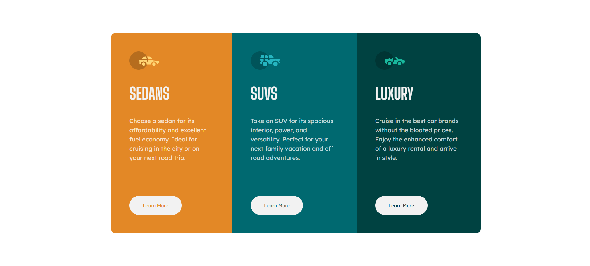
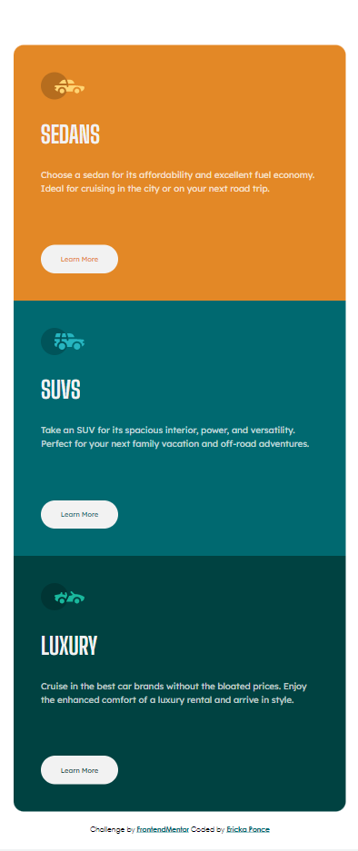

# Frontend Mentor - 3-column preview card component

## Welcome! 👋

Thanks for checking out this front-end coding challenge.

# Frontend Mentor - 3-column preview card component solution

This is a solution to the [3-column preview card component challenge on Frontend Mentor](https://www.frontendmentor.io/challenges/3column-preview-card-component-pH92eAR2-). 

## Overview

### The challenge

Users should be able to:

- View the optimal layout depending on their device's screen size
- See hover states for interactive elements

### Screenshot

### Links

- Solution URL: [GitHub](https://github.com/iEerii/3columnPreview)
- Live Site URL: [Netlify](columnresponsive.netlify.app)

## My process

### Built with

- Semantic HTML5 markup
- CSS custom properties
- Flexbox

## Author

- Frontend Mentor - [GitHub](https://www.frontendmentor.io/profile/@iEerii)
